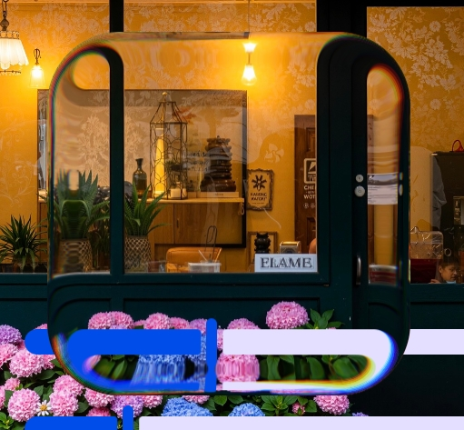

<div align="center">


## AndroidLiquidGlassView
**Android imitation of iOS 26 liquid glass effect, AndroidLiquidGlassView library has real refraction and dispersion effect**

<br>

[](https://GitHub.com/QmDeve/AndroidLiquidGlassView/)
[](https://gitlab.com/QmDeve/AndroidLiquidGlassView)

[](https://t.me/QmDeves)

  
  
  

<br>
<br>

English | [简体中文](./README_zh.md)

</div>

---

## Characteristic
- **Realistic `liquid glass` effect - Physically-based `refraction` and `dispersion` effects**
- **Height can be customized - support the adjustment of rounded corner radius, refraction height, refraction offset, dispersion parameters, blur radius, tone, etc**
- **Based on physical and realistic elastic effects**

## Screenshot



## Demo experience
**[Download Demo](./app/release/app-release.apk)**

# Start using
### Quick integration


**Add dependencies in the `dependencies{}` block of `build.gradle`**
```gradle
dependencies {
   implementation 'com.qmdeve.liquidglass:core:1.0.0'
}
```

## Quick use
**Usage: [https://liquidglass.qmdeve.com/](https://liquidglass.qmdeve.com/)**

---

## Effect explaination
**On `Android 13` and later devices, the library renders the full `Liquid Glass` effect, including:**
- **`Physics-based refraction effects`**
- **`Adjustable blur effect`**
- **`Dispersion effect`**
- **`Custom tint overlay`**

**On devices below Android 13, the view will maintain a transparent background and will not render any effects**

## Star History
[](https://starchart.qmdeve.com/QmDeve/AndroidLiquidGlassView)

## My open source project
 - **[QmBlurView](https://github.com/QmDeve/QmBlurView)**
 - **[Qm Authenticator for Android](https://github.com/Rouneant/Qm-Authenticator-for-Android)**

## License
```
Copyright ©️ 2025 QmDeve

Permission is hereby granted, free of charge, to any person obtaining a copy
of this software and associated documentation files (the "Software"), to deal
in the Software without restriction, including without limitation the rights
to use, copy, modify, merge, publish, distribute, sublicense, and/or sell
copies of the Software, and to permit persons to whom the Software is
furnished to do so, subject to the following conditions:

The above copyright notice and this permission notice shall be included in all
copies or substantial portions of the Software.

THE SOFTWARE IS PROVIDED "AS IS", WITHOUT WARRANTY OF ANY KIND, EXPRESS OR
IMPLIED, INCLUDING BUT NOT LIMITED TO THE WARRANTIES OF MERCHANTABILITY,
FITNESS FOR A PARTICULAR PURPOSE AND NONINFRINGEMENT. IN NO EVENT SHALL THE
AUTHORS OR COPYRIGHT HOLDERS BE LIABLE FOR ANY CLAIM, DAMAGES OR OTHER
LIABILITY, WHETHER IN AN ACTION OF CONTRACT, TORT OR OTHERWISE, ARISING FROM,
OUT OF OR IN CONNECTION WITH THE SOFTWARE OR THE USE OR OTHER DEALINGS IN THE
SOFTWARE.
```